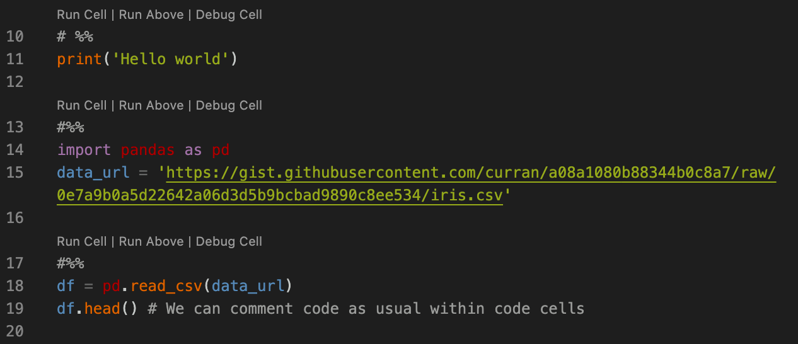
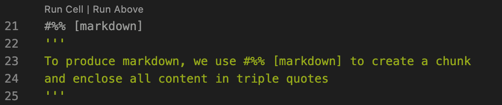

# Easy markdown in python scripts 🐍


Markdown is a popular, lightweight markup language commonly used for text formatting. Whilst markdown can be written in a standalone file (for example, a `README.md`), it is also used in R Markdown (`.Rmd`) files and Jupyter (IPython) notebooks (`.ipynb`). In this blog post, we look at the advantages and disadvantages of notebooks and how we can use markdown directly in standard `.py` Python scripts. 

As an aside, R Markdown has other advantages over plain markdown, such as being publishable into R bookdown format... But that's a blog post for another time!

---
**IPython or Jupyter?**

IPython refers primarily to the interactive shell on which notebooks themselves run. [As of 2014](https://blog.jupyter.org/the-big-split-9d7b88a031a7), several language-agnostic elements of the IPython ecosystem including notebooks were relaunched as Project Jupyter. So sometimes we see Jupyter notebooks still referred to as IPython notebooks - these names refer to the same tool (and they still use the same `.ipynb` file extension)!

---

## Jupyter (`.ipynb`) notebooks
Jupyter notebooks are a very popular way of presenting and developing Python code, particularly in exploratory data analysis and educational settings; both [kaggle](https://kaggle.com) and [Google Colab](https://colab.research.google.com) provide access to hosted notebooks.

Part of this popularity comes from the ease of inserting plain text and markdown within and around the code, allowing explanations and a narrative thread to run through the script and aid readability. Cell-based execution allows users to run cells in different orders, examining various elements of the code without any requirement to run the full script. Further, it is simple to export notebooks to shareable HTML or PDF reports; the embedded markdown reduces any requirement for additional processing. 

Notebooks do come with limitations however. While there are tools available for debugging notebooks (e.g. the [IPython core debugger](https://ipython.readthedocs.io/en/stable/api/generated/IPython.core.debugger.html)), these do not have the functionality available in the native VSCode debugger (or those in similar IDEs). Hence, it is often suggested to export the `.ipynb` file as a `.py` script for debugging purposes.


Further, a crucial feature of notebooks is that they are saved in `JSON` format to retain knowledge of the state. The saved version of the notebook retains this state - unlike a Python script which is purely a set of instructions with no state information. 

The code snippet below (taken from [ipython.org](https://ipython.org/ipython-doc/3/notebook/nbformat.html)) shows an example of how a code cell is stored, with features such as execution count and outputs in addition to the source code. 

```json
{
  "cell_type" : "code",
  "execution_count": 1, # integer or null
  "metadata" : {
      "collapsed" : True, # whether the output of the cell is collapsed
      "autoscroll": False, # any of true, false or "auto"
  },
  "source" : ["some code"],
  "outputs": [{
      # list of output dicts (described below)
      "output_type": "stream",
      ...
  }],
}
```

Whilst this feature can be convenient when returning to partially run notebooks, it can introduce issues with version control, a vital part of any collaborative workflow. With no code changes, simply running a cell introduces a change to the underlying JSON. This results in git tracking changes including the running of cells, in addition to any changed code/markdown. Code reviews can get very messy, very quickly. 

While there are hacks to get around this, such as [saving the file as .Rmd format](https://towardsdatascience.com/version-control-with-jupyter-notebooks-f096f4d7035a) for version control, it would be great if we could harness some of the positives of notebooks, including the rich markdown features available, without the associated version control issues. Fortunately we can(!) since VSCode supports running of `.py` files as notebooks in the interactive window, including markdown. 

## Running a `.py` script as a notebook
The following has been tested in Visual Studio Code Version 1.61.1.

To run `.py` content as notebook cells, we first need to install the `ipykernel` package. 

Within the script itself, we prefix sections of code with `# %%` and this allows us to simply run code in sections, with output displayed in the interactive window, much like in a Jupyter notebook.



But we can also create a markdown cell, using `# %% [markdown]` and surrounding markdown content with `‘’’triple quotes’’’`.  



To export content displayed in the interactive window to HTML, we require the `nbconvert` package. Once this is installed, simply click 'Export' in the interactive window and all displayed output will be exported to a HTML file. It is worth clearing output in the interactive window and rerunning all cells in order, as the exported output will be the contents of the interactive window, **not** the raw code and markdown chunks contained in the Python script. 

Since all cell and markdown information is contained within comments, and the file exists as a Python script, we experience none of the complications with version control as seen for notebooks. And of course, the script can easily be debugged using standard IDE debugging tools. Overall there are advantages and disadvantages to each method, depending on your goals, but in many contexts the integrated markdown approach provides enough text markup functionality without losing robust version control and debugging tools. 